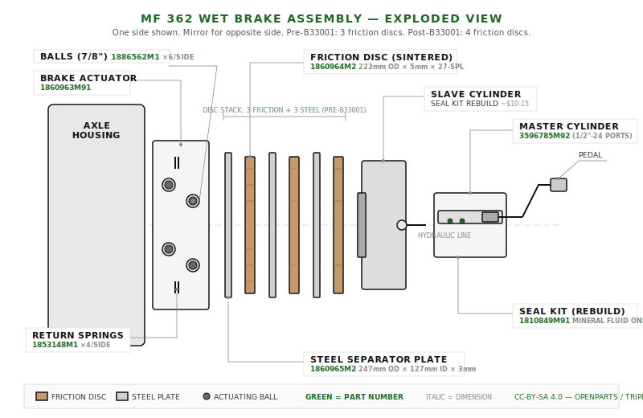

# MF 362 — Brake System Parts

## Overview

The MF 362 uses **oil-immersed (wet) disc brakes** housed in the rear axle housings. Each side has a stack of friction discs and steel separator plates, compressed by a hydraulic slave cylinder. A master cylinder on each brake pedal provides hydraulic actuation. The handbrake operates via cables.

!!! warning "Serial Number Break Point — Disc Count Changed"
    The number of friction discs per side changed at **serial number B33001**:

    - **Before B33001:** 3 friction discs per side (6 total)
    - **After B33001:** 4 friction discs per side (8 total)

    Count your existing discs or check your serial number **before ordering**. Getting this wrong means a second parts order and more downtime.

---

## Parts Diagram

---

## Friction Discs

**These are wear items — always replace during a rebuild.**

| Specification | Value |
|---|---|
| **OEM Part Number** | 1860964M2 |
| **Alternate OEM** | 1669474M1 |
| **Sparex Cross-Ref** | S.40486 |
| **Outside Diameter** | 223mm (8.779") |
| **Inside Diameter** | 55–62mm (2.385") |
| **Thickness** | 5mm |
| **Lining Width** | 17.5mm |
| **Spline Count** | 27 |
| **Spline OD** | 62mm |
| **Spline ID** | 56mm |
| **Material** | Sintered |

**Quantity needed:**

- Before S/N B33001: **6** (3 per side)
- After S/N B33001: **8** (4 per side)

!!! tip "Buying tip"
    Order a full set — don't mix old and new friction discs. Uneven wear on the stack causes grabbing and uneven braking.

---

## Steel Separator Plates

| Specification | Value |
|---|---|
| **OEM Part Number** | 1860965M2 |
| **Alternate OEM** | 1860965M1, K945755, K963647 |
| **Sparex Cross-Ref** | — |
| **ICP Cross-Ref** | ICP1204MP |
| **David Brown Cross-Ref** | K945755, K963647 |
| **Leyland Cross-Ref** | 37H8181 |
| **Valmet Cross-Ref** | 411040 |
| **Outside Diameter** | 247mm (8.976") |
| **Inside Diameter** | 127mm (4.960") |
| **Thickness** | 3mm |
| **Material** | Steel |

**Quantity:** 3 per side (6 total) — same for all serial numbers.

!!! note "Inspect before replacing"
    Separator plates are steel and don't wear like friction discs. Check for warping, scoring, and heat discoloration. If they mic out flat and aren't scored, they're reusable. Save yourself $50–80.

---

## Brake Actuator Assembly

| Specification | Value |
|---|---|
| **OEM Part Number** | 1860963M91 |
| **Alternate OEM** | 1860963M92 |
| **Diameter** | 229mm (9") |

**Rebuild components (per side):**

| Component | Part Number | Qty per Side |
|---|---|---|
| Actuating balls (7/8") | 1886562M1 | 6 |
| Return springs | 1853148M1 | 4 |

!!! tip "Rebuild first"
    The actuator housing itself rarely fails. Replace the balls and springs, clean everything up, and you're good. A full actuator replacement is almost never necessary.

---

## Master Cylinder

| Specification | Value |
|---|---|
| **OEM Part Number** | 3596785M92 |
| **Sparex Cross-Ref** | S.42267 |
| **Port Thread** | 1/2"–24 |
| **Rod Thread** | 5/16"–20 |

**Seal kit for rebuild:** OEM 1810849M91

!!! warning "Brake fluid compatibility"
    This system uses **mineral-based brake fluid** — not DOT 3/4/5. Using the wrong fluid will destroy the seals. Confirm fluid type before topping off or rebuilding.

!!! tip "When to rebuild vs. replace"
    Pull the master cylinder and inspect the bore. If it's smooth with no scoring or pitting, a $15–25 seal kit is all you need. Only replace the whole cylinder if the bore is damaged.

**Cross-application — this master cylinder also fits:**

MF 340, 342, 350, 352, 355, 360, 362, 365, 372, 375, 382, 383, 390, 390T, 398, 399

---

## Slave Cylinders

One per side, mounted in the rear axle housing.

**Rebuild components (per side):**

| Component | Notes |
|---|---|
| Rod seal kit (LH or RH) | ~$10–15 per side |
| Rod bearing | Inspect — replace if worn |
| Rod tube | Inspect — replace if scored |
| Slave rod | Inspect — replace if bent or worn |
| Locking nut | Replace if damaged |

!!! tip "Slave cylinder rebuild"
    These are almost always rebuildable. Seal kits are cheap and readily available. A full slave cylinder replacement is rarely needed unless the bore is damaged.

---

## Handbrake Cables

!!! warning "Confirm your configuration before ordering"
    Handbrake cables vary by **2WD vs. 4WD** and brake type. Get the wrong ones and they won't fit. Confirm your setup first.

| Side | OEM Part Number |
|---|---|
| Right-hand | 3596772M92 |
| Left-hand | 3596775M92 |

---

## Cross-Reference Table

Full cross-reference for all brake components across manufacturers:

| Component | MF OEM | Sparex | Case/David Brown | Leyland | Valmet | ICP |
|---|---|---|---|---|---|---|
| Friction disc | 1860964M2 | S.40486 | — | — | — | — |
| Separator plate | 1860965M2 | — | K945755 / K963647 | 37H8181 | 411040 | ICP1204MP |
| Brake actuator | 1860963M91 | — | — | — | — | — |
| Actuating balls | 1886562M1 | — | — | — | — | — |
| Return springs | 1853148M1 | — | — | — | — | — |
| Master cylinder | 3596785M92 | S.42267 | — | — | — | — |
| Master cyl. seal kit | 1810849M91 | — | — | — | — | — |
| Handbrake cable (RH) | 3596772M92 | — | — | — | — | — |
| Handbrake cable (LH) | 3596775M92 | — | — | — | — | — |

---

## Dimensions Reference

Use this table if you're machining replacements or sourcing from non-standard suppliers:

| Component | OD | ID | Thickness | Other |
|---|---|---|---|---|
| Friction disc | 223mm (8.779") | 55–62mm (2.385") | 5mm | 27-spline, lining width 17.5mm |
| Separator plate | 247mm (8.976") | 127mm (4.960") | 3mm | Plain steel |
| Brake actuator | 229mm (9") | — | — | — |

---

## Rebuild vs. Replace: Cost Comparison

!!! tip "Rebuild first — save $200–400"
    A rebuild-first approach on the brake system saves significant money and is usually all that's needed. Replace only what's actually worn or damaged.

### Rebuild-First Approach

| Item | Est. Cost |
|---|---|
| Friction discs (full set) | $120–180 |
| Actuating balls (12 total) | $20–30 |
| Return springs (8 total) | $15–25 |
| Master cylinder seal kit | $15–25 |
| Slave cylinder seal kits (×2) | $20–30 |
| Brake fluid | $15–20 |
| Misc. gaskets & seals | $14–26 |
| **Total (both sides)** | **$219–336** |

### Full Replacement

| Item | Est. Cost |
|---|---|
| Friction discs (full set) | $120–180 |
| Separator plates (full set) | $50–80 |
| Brake actuators (×2) | $100–200 |
| Master cylinders (×2) | $80–160 |
| Slave cylinders (×2) | $40–60 |
| Brake fluid | $15–20 |
| Misc. gaskets & seals | $14–26 |
| **Total (both sides)** | **$408–714** |

The rebuild path gets you the same result for about half the cost. The only reason to go full replacement is if the bores are scored, housings are cracked, or you just want to throw parts at it and move on.
